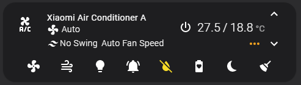

# xiaomi_miot_air_conditioner

Home Assistant custom component for Xiaomi Air Conditioner A (MIoT version) based on `python-miio`.

[中文说明](README_zh.md)

## Supported features

* Climate Entity:
  * Temperature (16~31°C per 0.5°C)
  * Mode (Cool, Dry, Fan only, Heat)
  * Fan speed (Level1~7, Auto)
  * Swing mode (Vertical)
  * Aux heating

* Switch Entity:
  * LED
  * Buzzer
  * Sleep mode
  * Dryer mode
  * ECO mode
  * Auto Clean mode

## Supported models

* [xiaomi.aircondition.mc1](https://home.miot-spec.com/spec/xiaomi.aircondition.mc1)
* [xiaomi.aircondition.mc2](https://home.miot-spec.com/spec/xiaomi.aircondition.mc2)
* [xiaomi.aircondition.mc4](https://home.miot-spec.com/spec/xiaomi.aircondition.mc4)
* [xiaomi.aircondition.mc5](https://home.miot-spec.com/spec/xiaomi.aircondition.mc5)

Other MIoT model may probably work. More tests are welcomed.

## Configuration

Go to `Lovelace UI` -> `Configuration` -> `Devices & Services` -> `Add Integration` -> `xiaomi_miot_air_conditioner`, fill in device IP, token, name and retry count, and then `Submit`.

## Example Lovelace Configuration

* Front-end modules used: `mini-climate`



```yaml
type: custom:mini-climate
entity: climate.xiaomi_ac
name: Xiaomi Air Conditioner A
target_temperature:
  icons:
    up: mdi:chevron-up
    down: mdi:chevron-down
  unit: °C
  min: 16
  max: 31
  step: 0.5
toggle:
  default: 'on'
indicators:
  swing_mode:
    icon: mdi:tailwind
    source:
      attribute: swing_mode
      mapper: |
        (val) => (val == 'vertical' ? "Vertical Swing" : "No Swing")
  fan_percent:
    source:
      attribute: fan_speed_percent
      mapper: |
        (val) => ((val == 101) ? "Auto Fan Speed" : ("Fan Speed " + val + "%"))
buttons:
  swing:
    type: dropdown
    icon: mdi:weather-windy
    state:
      attribute: swing_mode
    source:
      'off': No Swing
      vertical: Vertical Swing
    change_action: >
      (sel, state, entity) => this.call_service('climate', 'set_swing_mode', {
      entity_id: entity.entity_id, swing_mode: sel })
  led:
    type: button
    icon: mdi:lightbulb
    state:
      entity: switch.xiaomi_ac_led_enabled
  buzzer:
    icon: mdi:bell-ring
    state:
      entity: switch.xiaomi_ac_buzzer
  dryer:
    icon: mdi:water-off
    state:
      entity: switch.xiaomi_ac_dryer_mode
  eco:
    icon: mdi:battery-heart-variant
    state:
      entity: switch.xiaomi_ac_eco_mode
  sleep:
    icon: mdi:power-sleep
    state:
      entity: switch.xiaomi_ac_sleep_mode
  clean:
    icon: mdi:broom
    state:
      entity: switch.xiaomi_ac_clean_mode
```