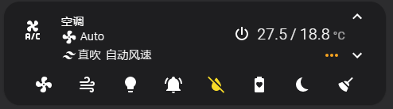

# xiaomi_miot_air_conditioner

小米互联网空调A (MIoT协议) 的Home Assistant插件，基于`python-miio`

[English](README.md)

## 支持的功能

* Climate实体:
  * 温度 (16~31°C，可按0.5°C调节)
  * 模式 (制冷, 干燥, 送风, 制热)
  * 风速 (1~7档、自动)
  * 扫风模式 (垂直)
  * 辅热

* Switch实体:
  * LED开关
  * 蜂鸣器开关
  * 睡眠模式
  * 干燥模式
  * 省电模式
  * 自动清洁模式

## 支持的设备

* [小米互联网空调A（大1匹|变频|一级能效）xiaomi.aircondition.mc1](https://home.miot-spec.com/spec/xiaomi.aircondition.mc1)
* [	小米互联网空调A（1.5匹|变频|一级能效）xiaomi.aircondition.mc2](https://home.miot-spec.com/spec/xiaomi.aircondition.mc2)
* [小米互联网空调A（大1匹|变频|超一级能效）xiaomi.aircondition.mc4](https://home.miot-spec.com/spec/xiaomi.aircondition.mc4)
* [小米互联网空调A（1.5匹|变频|超一级能效）xiaomi.aircondition.mc5](https://home.miot-spec.com/spec/xiaomi.aircondition.mc5)

其它MIoT协议的空调设备理论也可用，求好心人测试 ^_^

## 配置说明

打开`Lovelace` -> `配置` -> `设备与服务` -> `添加集成` -> `xiaomi_miot_air_conditioner`，填写设备IP、token、名称、重试次数，提交即可。


## Lovelace配置示例

* 推荐安装的前端模块: `mini-climate`



```yaml
type: custom:mini-climate
entity: climate.xiaomi_ac
name: 空调
target_temperature:
  icons:
    up: mdi:chevron-up
    down: mdi:chevron-down
  unit: °C
  min: 16
  max: 31
  step: 0.5
toggle:
  default: 'on'
indicators:
  swing_mode:
    icon: mdi:tailwind
    source:
      attribute: swing_mode
      mapper: |
        (val) => (val == 'vertical' ? "垂直扫风" : "直吹")
  fan_percent:
    source:
      attribute: fan_speed_percent
      mapper: |
        (val) => ((val == 101) ? "自动风速" : ("风速" + val + "%"))
buttons:
  swing:
    type: dropdown
    icon: mdi:weather-windy
    state:
      attribute: swing_mode
    source:
      'off': 直吹
      vertical: 垂直扫风
    change_action: >
      (sel, state, entity) => this.call_service('climate', 'set_swing_mode', {
      entity_id: entity.entity_id, swing_mode: sel })
  led:
    type: button
    icon: mdi:lightbulb
    state:
      entity: switch.xiaomi_ac_led_enabled
  buzzer:
    icon: mdi:bell-ring
    state:
      entity: switch.xiaomi_ac_buzzer
  dryer:
    icon: mdi:water-off
    state:
      entity: switch.xiaomi_ac_dryer_mode
  eco:
    icon: mdi:battery-heart-variant
    state:
      entity: switch.xiaomi_ac_eco_mode
  sleep:
    icon: mdi:power-sleep
    state:
      entity: switch.xiaomi_ac_sleep_mode
  clean:
    icon: mdi:broom
    state:
      entity: switch.xiaomi_ac_clean_mode
```